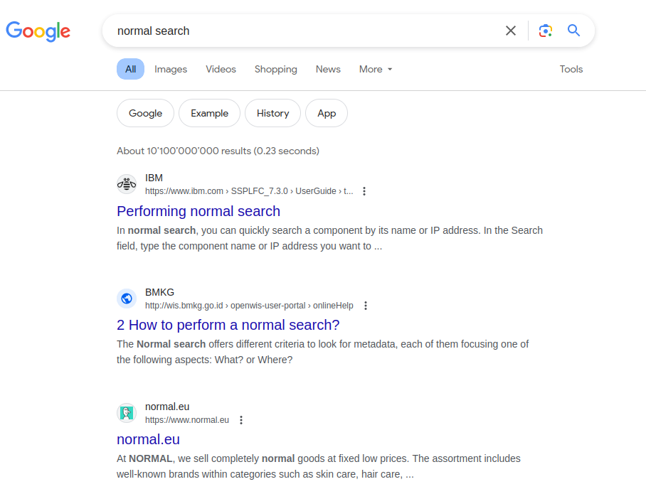
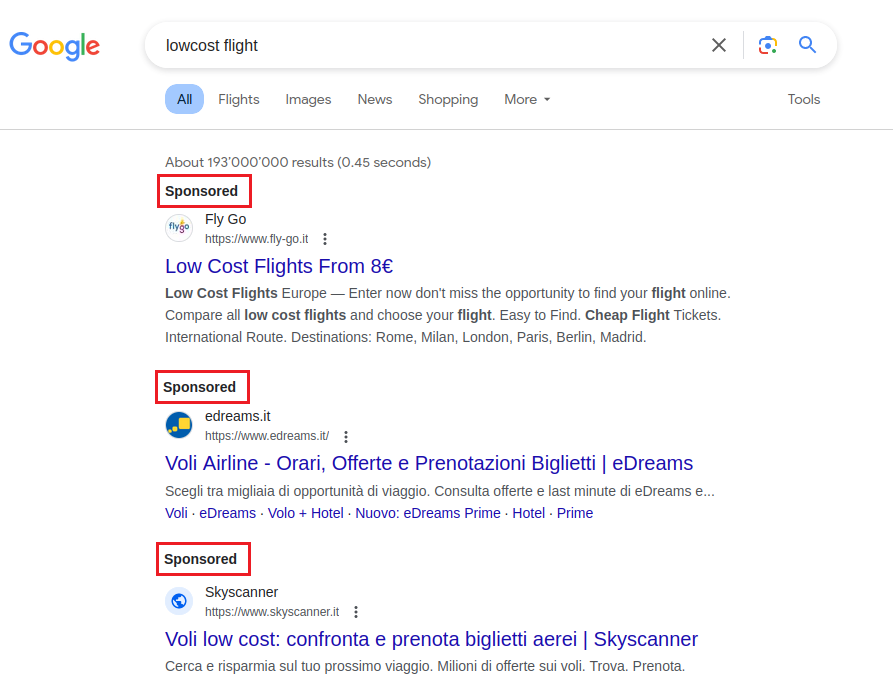

+++
title = 'Malicious Ads'
date = 2024-04-11T17:04:31+02:00
draft = false
image = '/posts/google-ads/static/cover.png'
+++

# Introduction

In today's world of computers, it's super easy to find stuff online. We often use search engines like Google, Bing, or
DuckDuckGo to help us find what we're looking for. Whether we want to visit a website we know or find something new,
search engines are a big part of how we use the internet.

But what happens when we trust these search engines too much? Picture this: you type the name of a famous company into
Google, and you click on a link that looks legit, but it's actually a trick. This happens more than you might think in
the world of online scams, where bad guys use ads on search engines to trick people into giving away their personal
info.

In this blog post, we're going to talk about how bad guys use Google Ads (used to be called AdWords) to trick people
into giving away their personal information. We'll explain how they do it and why it's a problem. Even though people
have been trying to stop these scams for more than ten years, they're still a big danger for people who aren't careful
online.

We'll also look at what might happen if you fall for one of these scams. And finally, we'll give you some tips on how to
protect yourself using our **BrowserFence** solution.

## How Google Ads Work

Google Ads is a service that lets people pay to have their website show up at the top of Google search results. When you
search for something on Google, you'll see a list of websites that match your search terms. The normal behavior of a
user is to click on the first link that appears in the search results. Normally the first link is the most relevant to
the search query, meaning it's the most likely to have the information you're looking for or the platform you want to
access.

Normal search looks like this:

Now let's see what happens when we search for something that has ads:

As we can see from the image above, the first results are ads. This means that they are not organic results, but rather
paid results.
In the red box (that we added for highlighting purposes), we can see the word "Sponsored" which indicates that the
result is an ad,
but it's not always easy to spot, especially if you're in a hurry or not paying attention.

## The Phishing Scenario

Now imagine you're searching for your e-banking website, you type the name of your bank into Google, and you click on
the first link that appears. Thanks to the fact that the "Promoted" label is not so visible, you don't notice that the
link is an ad. You enter your
username, password, other security codes, and click "Login".

What you don't know is that the website you just entered your information into is a fake website created by bad guys to
steal your information. So even ***without compromising the bank's security***, the bad guys have your credentials and
can now
use your information to steal your money, your identity, or even your reputation.

A similar scenario can happen with any website, not just for logins. For example, you might be looking for a new
software, and you click on the first link that appears in the search results. The website you land on might look like
the official website of the software, but it's actually a fake website that will install malware on your computer and,
potentially, ***compromise all your company's data***.

## How Bad Guys Use Google Ads

The question ad this point is: how do bad guys manage to get their ads to show up at the top of Google search results?
The answer is simple: they pay for appearing at the top of specific search queries. This means that they can pay to have
their fake website show up at the top of the search results when you search for something like "my-bank login" or "
new-software
download".

So Google doesn't have any checks in place to verify the legitimacy of the ads that are being displays? Of course they
do, but the bad guys are always one step ahead. They use specific techniques, for example "cloaking", to trick Google's
checks and get
their ads to pass through the verification process. Especially when the ads are targeting regional markets, it's hard
for Google to verify the legitimacy of the ads.

## What Happens If You Fall For A Scam

In this blog post we are not going to talk about the technical details of the post-scam scenario, but we can see from
the following schema what happens when you fall for a scam:

This schema resulted from
an [analysis](https://www.zscaler.com/blogs/security-research/malvertising-campaign-targeting-it-teams-madmxshell) of a
real case conducted by Zscaler ThreatLabz researchers Roy Tay and Sudeep Singh.

Even if we are not going to talk about the technical details, it's clear that the user's browser becomes the exploited
gateway for attackers through Google ads. This manipulation can serve as the initial step in a chain of attacks,
potentially compromising both the user's computer and the company's infrastructure.

## Protect Yourself With BrowserFence

The best way to protect yourself from these scams is to use our **BrowserFence** solution. Our solution is able to
detect the ads in the search results and highlight them with a purple border. This way, you can easily spot the ads and
avoid clicking on them, or at least be aware that the result is an ad.

Take a look to the following animation to see how BrowserFence in action:

    

        

            
            <a href="static/bf.mp4" class="nk-block-video-play video-popup btn-play btn-play-sm btn-play-s2">
                <em class="btn-play-icon"></em>
            </a>
        

    

 

## Conclusion

In this blog post, we've talked about how bad guys use Google Ads to trick people into giving away their personal info
or installing malware on their computers. We've explained how they do it and why it's a problem. We've also looked at
what might happen if you fall for one of these scams. And finally, we've given you some tips on how to protect yourself
using our **BrowserFence** solution.

We hope you found this blog post helpful. If you have any questions, please feel free to contact us. We're always happy to help.

<ul class="pt-4 d-flex gaps g-3 justify-content-center  animated" data-animate="fadeInUp" data-delay=".9">
    <li>
        <a href="#" class="btn btn-md btn-grad" data-overlay="bg-theme-grad-alternet"
           style="position: relative; top: 50px;">Install BrowserFence</a>
    </li>
</ul>
