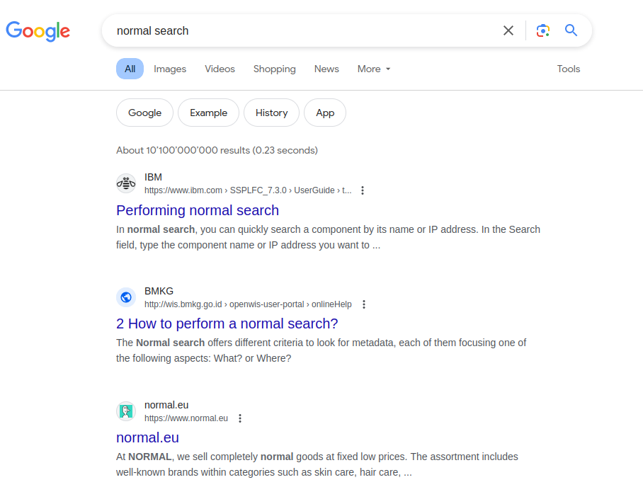
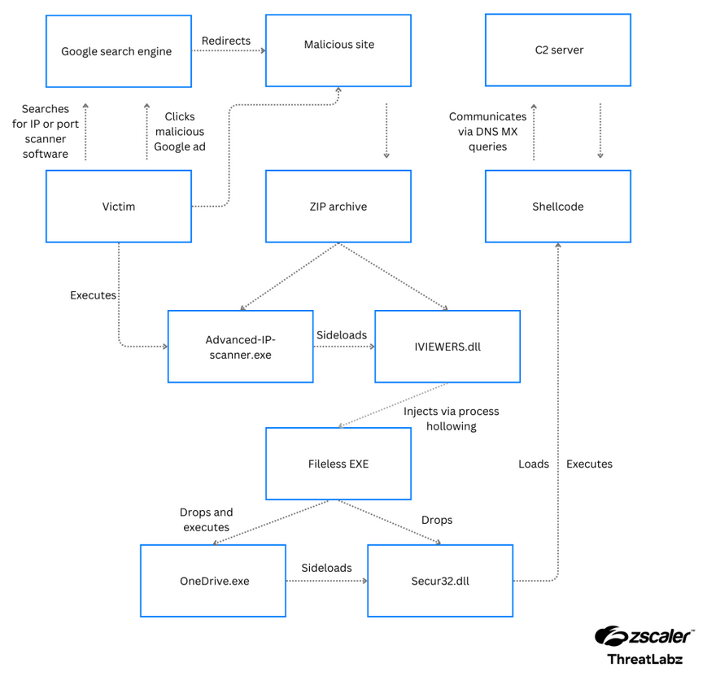

+++
title = 'Annonces Malveillantes'
date = 2024-04-11T17:04:31+02:00
draft = false
image = '/posts/google-ads/static/cover.png'
+++

# Introduction

Dans le monde informatique d'aujourd'hui, il est très facile de trouver des informations en ligne. Nous utilisons souvent des moteurs de recherche tels que Google, Bing ou DuckDuckGo pour nous aider à trouver ce que nous recherchons. Que nous souhaitions visiter un site Web que nous connaissons ou découvrir quelque chose de nouveau, les moteurs de recherche jouent un rôle important dans notre utilisation d'Internet.

Mais que se passe-t-il lorsque nous faisons trop confiance à ces moteurs de recherche ? Imaginez ceci : vous tapez le nom d'une entreprise célèbre sur Google et cliquez sur un lien qui semble légitime, mais qui est en réalité un piège. Cela arrive plus souvent que vous ne le pensez dans le monde des arnaques en ligne, où les escrocs utilisent des annonces sur les moteurs de recherche pour tromper les gens et les amener à divulguer leurs informations personnelles.

Dans cet article de blog, nous allons parler de la façon dont les escrocs utilisent Google Ads (anciennement AdWords) pour tromper les gens et les amener à divulguer leurs informations personnelles. Nous expliquerons comment ils s'y prennent et pourquoi c'est un problème. Bien que les gens essaient d'arrêter ces arnaques depuis plus de dix ans, elles représentent toujours un grand danger pour ceux qui ne font pas attention en ligne.

Nous examinerons également ce qui pourrait se passer si vous tombez dans l'une de ces arnaques. Et enfin, nous vous donnerons quelques conseils sur la façon de vous protéger en utilisant notre solution **BrowserFence**.

## Comment fonctionnent les annonces Google

Google Ads est un service qui permet aux gens de payer pour que leur site Web apparaisse en haut des résultats de recherche Google. Lorsque vous recherchez quelque chose sur Google, vous verrez une liste de sites Web correspondant à vos termes de recherche. Le comportement normal d'un utilisateur est de cliquer sur le premier lien qui apparaît dans les résultats de recherche. Normalement, le premier lien est le plus pertinent par rapport à la requête de recherche, ce qui signifie qu'il est le plus susceptible de contenir les informations que vous recherchez ou la plateforme que vous souhaitez accéder.

La recherche normale ressemble à ceci :

 
Voyons maintenant ce qui se passe lorsque nous recherchons quelque chose qui contient des annonces :

Comme nous pouvons le voir sur l'image ci-dessus, les premiers résultats sont des annonces. Cela signifie qu'il ne s'agit pas de résultats organiques, mais de résultats payés.
Dans la case rouge (que nous avons ajoutée à des fins de mise en évidence), nous pouvons voir le mot "Sponsorisé", ce qui indique que le résultat est une annonce,
mais il n'est pas toujours facile de le remarquer, surtout si vous êtes pressé ou si vous ne faites pas attention.

## Le scénario de phishing

Imaginez maintenant que vous recherchez le site Web de votre banque, vous tapez le nom de votre banque sur Google et cliquez sur le premier lien qui apparaît. Grâce au fait que le label "Sponsorisé" n'est pas si visible, vous ne remarquez pas que le lien est une annonce. Vous entrez votre
nom d'utilisateur, votre mot de passe, d'autres codes de sécurité et cliquez sur "Connexion".

Ce que vous ne savez pas, c'est que le site Web sur lequel vous venez de saisir vos informations est un faux site créé par des escrocs pour voler vos informations. Ainsi, même ***sans compromettre la sécurité de la banque***, les escrocs possèdent désormais vos identifiants et peuvent maintenant
utiliser vos informations pour voler votre argent, votre identité ou même votre réputation.

Un scénario similaire peut se produire avec n'importe quel site Web, pas seulement pour les connexions. Par exemple, vous pourriez rechercher un nouveau logiciel et cliquer sur le premier lien qui apparaît dans les résultats de recherche. Le site Web sur lequel vous arrivez pourrait ressembler au site officiel du logiciel, mais il s'agit en réalité d'un faux site qui installera un malware sur votre ordinateur et, potentiellement, ***compromettra toutes les données de votre entreprise***.

## Comment les escrocs utilisent Google Ads

La question à ce stade est : comment les escrocs parviennent-ils à faire apparaître leurs annonces en haut des résultats de recherche Google ? La réponse est simple : ils paient pour apparaître en haut des requêtes de recherche spécifiques. Cela signifie qu'ils peuvent payer pour que leur faux site Web apparaisse en haut des résultats de recherche lorsque vous recherchez quelque chose comme "connexion-ma-banque" ou "nouveau logiciel téléchargement".

Google n'a-t-il donc aucun contrôle pour vérifier la légitimité des annonces qui sont affichées ? Bien sûr qu'ils en ont, mais les escrocs ont toujours une longueur d'avance. Ils utilisent des techniques spécifiques, comme le "cloaking", pour tromper les contrôles de Google et faire
passer leurs annonces par le processus de vérification. Surtout lorsque les annonces ciblent des marchés régionaux, il est difficile pour Google de vérifier la légitimité des annonces.

## Que se passe-t-il si vous tombez dans une arnaque

Dans cet article de blog, nous n'allons pas parler des détails techniques du scénario post-arnaque, mais nous pouvons voir à partir du schéma suivant ce qui se passe lorsque vous tombez dans une arnaque :

Ce schéma est le résultat
d'une [analyse](https://www.zscaler.com/blogs/security-research/malvertising-campaign-targeting-it-teams-madmxshell) d'un cas réel mené par les chercheurs de Zscaler ThreatLabz, Roy Tay et Sudeep Singh.

Bien que nous n'allions pas parler des détails techniques, il est clair que le navigateur de l'utilisateur devient la passerelle exploitée par les attaquants via les annonces Google. Cette manipulation peut servir de première étape dans une chaîne d'attaques,
compromettant potentiellement à la fois l'ordinateur de l'utilisateur et l'infrastructure de l'entreprise.

## Protégez-vous avec BrowserFence

Le meilleur moyen de vous protéger contre ces arnaques est d'utiliser notre solution **BrowserFence**. Notre solution est capable de
détecter les annonces dans les résultats de recherche et de les mettre en évidence avec un cadre violet. De cette manière, vous pouvez facilement repérer les annonces et
éviter de cliquer dessus, ou au moins être conscient que le résultat est une annonce.

Regardez l'animation suivante pour voir BrowserFence en action :

    

        

            
            <a href="/posts/google-ads/static/bf.mp4" class="nk-block-video-play video-popup btn-play btn-play-sm btn-play-s2"><em class="btn-play-icon"></em></a>
        

    

 

## Conclusion

Dans cet article de blog, nous avons parlé de la manière dont les escrocs utilisent Google Ads pour tromper les gens et les amener à divulguer leurs informations personnelles ou à installer des malwares sur leurs ordinateurs. Nous avons expliqué comment ils s'y prennent et pourquoi c'est un problème. Nous avons également examiné ce qui pourrait se passer si vous tombiez dans l'une de ces arnaques. Et enfin, nous vous avons donné quelques conseils sur la façon de vous protéger en utilisant notre solution **BrowserFence**.

Nous espérons que vous avez trouvé cet article de blog utile. Si vous avez des questions, n'hésitez pas à nous contacter. Nous sommes toujours heureux de vous aider.

<ul class="pt-4 d-flex gaps g-3 justify-content-center  animated" data-animate="fadeInUp" data-delay=".9">
    <li>
        <a href="#" class="btn btn-md btn-grad" data-overlay="bg-theme-grad-alternet"
           style="position: relative; top: 50px;">Installer BrowserFence</a>
    </li>
</ul>
