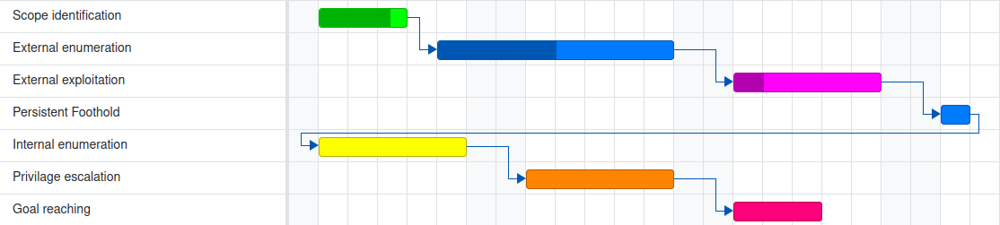

+++
title = 'CTEM über Red Teaming'
date = 2024-07-29T17:04:31+02:00
draft = false
image = '/posts/ctem/static/cover.jpg'
+++

## Einführung

Bei TeamFence sind wir stets auf der Suche nach neuen Möglichkeiten, die Sicherheitslage unserer Kunden zu verbessern. In diesem Blogbeitrag werden wir das Continuous Threat Exposure Management (CTEM) Framework diskutieren und aufzeigen, wie es Organisationen dabei helfen kann, die Gefährdung durch Cyberangriffe zu minimieren. Wir werden CTEM auch mit Red Teaming und simulierten Angriffen vergleichen, um die Vorteile eines proaktiven Sicherheitsansatzes zu verstehen.

## Was ist CTEM?

Das Continuous Threat Exposure Management (CTEM) ist ein dynamisches und kontinuierliches Fünf-Stufen-Framework, das entwickelt wurde, um die Gefährdung durch Cyberangriffe zu minimieren. Dieser proaktive Ansatz hilft Organisationen, Schwachstellen zu identifizieren, sie potenziellen Angriffspfaden zuzuordnen, Prioritäten basierend auf dem Risiko für kritische Vermögenswerte zu setzen und den Fortschritt der Abhilfemaßnahmen zu verfolgen. Unternehmen auf der ganzen Welt setzen CTEM ein, um ihre Exposition effektiv zu verwalten und ihre Sicherheitslage zu stärken.

CTEM umfasst eine gründliche Bewertung des gesamten Ökosystems einer Organisation, einschließlich Netzwerken, Systemen, Vermögenswerten und mehr, um Gefährdungen und Schwachstellen zu erkennen. Das Hauptziel besteht darin, die Wahrscheinlichkeit zu verringern, dass diese Schwachstellen von Angreifern ausgenutzt werden. Die Implementierung eines CTEM-Programms gewährleistet eine kontinuierliche Verbesserung der Sicherheitsmaßnahmen, indem potenziell problematische Bereiche identifiziert und angesprochen werden, bevor sie ausgenutzt werden können.

Der "kontinuierliche" Aspekt von CTEM betont die iterative Beziehung zwischen dem CTEM-Programm und den Abhilfemaßnahmen. Die aus beiden Elementen gewonnenen Daten informieren sich gegenseitig und erleichtern immer optimalere Entscheidungen zur Verwaltung von Expositionsrisiken.

Durch den Einsatz von CTEM können Organisationen ein widerstandsfähiges Sicherheitsframework sicherstellen, das sich an sich entwickelnde Bedrohungen anpasst und ihre kritischen Vermögenswerte kontinuierlich vor Cyberangriffen schützt.

## Die fünf Schritte des CTEM-Frameworks

#### Stufe 1 – Abgrenzung

Die erste Phase beinhaltet das Verständnis Ihrer Angriffsflächen und die Bestimmung der geschäftlichen Bedeutung jedes Vermögenswertes, wobei zu erkennen ist, dass sich diese Faktoren im Laufe der Zeit ändern werden. Dies umfasst die Identifizierung wichtiger Angriffsflächen mit Input von verschiedenen Entscheidungsträgern, wie z.B. Leitern aus IT, Recht, GRC, Entwicklung, Forschung & Entwicklung, Produkt und Geschäftsabläufen.

#### Stufe 2 – Entdeckung

In der Entdeckungsphase wird jedes Vermögenswert auf potenzielle Gefährdungen untersucht und die damit verbundenen Risiken analysiert. Dies geht über die Identifizierung eigenständiger Schwachstellen hinaus und umfasst andere Arten von Gefährdungen wie Active Directory-, Identitäts- und Konfigurationsrisiken sowie die Überlegung, wie diese Gefährdungen miteinander verknüpft werden könnten, um Angriffspfade zu Vermögenswerten zu schaffen.

#### Stufe 3 – Priorisierung

In der Priorisierungsphase werden Gefährdungen analysiert, um ihr Bedrohungsniveau basierend auf bekannten realen Vorfällen und der Bedeutung der betroffenen Vermögenswerte zu bestimmen. Dieser Schritt ist entscheidend, da Organisationen häufig mehr Gefährdungen ausgesetzt sind, als sie bewältigen können, aufgrund der schieren Menge und der sich ständig ändernden Umgebungen. CTEM hilft dabei, Abhilfemaßnahmen zu priorisieren, die das Risiko für kritische Vermögenswerte am effektivsten reduzieren, wobei alle Arten von Gefährdungen berücksichtigt werden, einschließlich Identitäten und Fehlkonfigurationen.

#### Stufe 4 – Validierung

Die Validierungsphase untersucht, wie Angriffe erfolgen können und wie wahrscheinlich sie sind, wobei verschiedene Tools für unterschiedliche Zwecke verwendet werden. Manchmal unterstützt die Validierung die Priorisierung wie in Phase 3, während sie in anderen Fällen verwendet wird, um Sicherheitskontrollen kontinuierlich zu testen oder periodische Penetrationstests zu automatisieren.

#### Stufe 5 – Mobilisierung

Die Mobilisierungsphase stellt sicher, dass jeder seine Rolle und Verantwortung im Kontext des Programms versteht. Eine effektive Mobilisierung erfordert, dass sowohl die Sicherheits- als auch die IT-Teams, die an den Abhilfemaßnahmen beteiligt sind, Klarheit über den Risikoreduktionswert ihrer Maßnahmen haben und über den allgemeinen Trend der Verbesserungen der Sicherheitslage im Laufe der Zeit berichten können.

## Ist CTEM besser als Red Teaming?

CTEM und Red Teaming sind beide wertvolle Werkzeuge zur Verbesserung der Sicherheitslage einer Organisation, aber sie dienen unterschiedlichen Zwecken. Wenn unser Hauptziel darin besteht, die Sicherheitslage einer Organisation zu verbessern, ist CTEM der richtige Weg. Lassen Sie uns sehen, warum:

#### Red Teaming

Eine Red Teaming-Aktivität zielt darauf ab, Schwachstellen in den Vermögenswerten eines Unternehmens zu identifizieren, indem ein Angriff simuliert wird, um die Kontrolle über kritische Systeme zu erlangen. Dieser Prozess beinhaltet ein Team von ethischen Hackern, die einen opportunistischen Ansatz verwenden, um Schwachstellen zu finden und auszunutzen, wobei sie sich ausschließlich auf das Erreichen ihres Ziels konzentrieren, ohne andere Probleme oder alternative Wege zu berücksichtigen.

Das folgende Bild könnte eine typische Red Teaming-Iteration darstellen:

 
Während Red Teaming wertvolle Einblicke in potenzielle Sicherheitslücken bietet, hat es einige bemerkenswerte Einschränkungen.

***Erstens*** bietet es eine Momentaufnahme anstelle einer kontinuierlichen Bewertung. Die während einer Red Teaming-Übung identifizierten Schwachstellen können schnell veraltet sein, da neue Bedrohungen auftauchen und sich die Umgebung des Unternehmens weiterentwickelt.

***Zweitens*** bietet Red Teaming keinen umfassenden Überblick über alle möglichen Schwachstellen. Es konzentriert sich auf bestimmte Angriffsvektoren und -pfade und kann andere kritische Bereiche der Exposition übersehen. Dieser enge Fokus kann dazu führen, dass einige Schwachstellen unentdeckt bleiben, insbesondere solche, die nicht mit den spezifischen Taktiken des Red Teams übereinstimmen.

***Schließlich***, wie wir auf dem obigen Bild sehen können, ist Red Teaming ein zeitaufwändiger und ressourcenintensiver Prozess, der möglicherweise nicht für Organisationen mit begrenzten Budgets oder betrieblichen Einschränkungen machbar ist. Die hohen Kosten und der Aufwand, die erforderlich sind, um Red Teaming-Übungen durchzuführen, können deren Häufigkeit und Wirksamkeit bei der Identifizierung und Behebung von Schwachstellen einschränken. Darüber hinaus ist das Ergebnis einer Red Teaming-Übung eine Liste von Schwachstellen und nicht eine priorisierte Liste von Gefährdungen, was oft dazu führt, dass Kunden selbst herausfinden müssen, wie sie die notwendigen Maßnahmen umsetzen können.

### CTEM

CTEM hingegen löst viele der Probleme, mit denen eine Organisation konfrontiert ist, wenn sie versucht, ihre Sicherheitslage zu verbessern:

***Ergebnisverarbeitung***: Viele Organisationen kämpfen damit, die Ergebnisse von Red Teaming oder anderen Angriffssimulationen zu verarbeiten, da sie die Ergebnisse als überwältigend empfinden und es schwierig finden, sie zu verstehen und zu priorisieren. CTEM umfasst eine Mobilisierungsphase, die sicherstellt, dass interne Teams die Risiken vollständig verstehen, wodurch sie in der Lage sind, Abhilfemaßnahmen effektiv zu priorisieren und umzusetzen.

***Zeit- und Kostenaufwand***: Wir müssen bedenken, dass diese Art von Aktivitäten B2B-Dienstleistungen sind und teuer sind. CTEM ist ein kostengünstigerer Ansatz für die Sicherheit, da die Aufzählungsphase der simulierten Angriffe durch eine Zusammenarbeit zwischen den Sicherheits- und IT-Teams ersetzt wird, um alle Vermögenswerte und Expositionen in der Organisation zu identifizieren.

***Abdeckung der Vermögenswerte***: CTEM ermöglicht eine 100%ige Abdeckung der Vermögenswerte, da die Entdeckungsphase nicht auf die Vermögenswerte beschränkt ist, die das Red Team finden kann, sondern eine Zusammenarbeit zwischen den Sicherheits- und IT-Teams darstellt. Dies bedeutet, dass alle Vermögenswerte berücksichtigt werden und das Risiko basierend auf der Bedeutung des Vermögenswertes berechnet wird.

***Kontinuierlich***: CTEM ist ein kontinuierlicher Prozess, was bedeutet, dass die Organisation immer über die Risiken informiert ist und entsprechend handeln kann. Das Sicherheitsteam kann die Infrastrukturänderungen verfolgen, neuen Bedrohungen und Schwachstellen folgen und die Sicherheitslage auf dem neuesten Stand halten. Dies entlastet das IT-Team erheblich, und der Kunde kann sich auf das Geschäft konzentrieren.

## Fazit

Zusammenfassend lässt sich sagen, dass Red Teaming zwar nützlich ist, um bestimmte Schwachstellen aufzudecken und die Wirksamkeit der Verteidigungsmaßnahmen eines Unternehmens gegen bestimmte Angriffsszenarien zu testen, seine Einschränkungen jedoch die Notwendigkeit für kontinuierlichere, umfassendere und kontextbewusstere Sicherheitsbewertungen verdeutlichen.

Bei TeamFence glauben wir, dass CTEM einen effektiveren und nachhaltigeren Ansatz für die Sicherheit bietet, indem es Sicherheit als Dienstleistung bereitstellt, die kontinuierlich überwacht und verwaltet wird, um die Exposition einer Organisation gegenüber Cyberbedrohungen zu minimieren. Durch die Einführung von CTEM können Unternehmen proaktiv Schwachstellen identifizieren und beheben, Abhilfemaßnahmen priorisieren und eine widerstandsfähige Sicherheitslage aufrechterhalten, die sich an sich entwickelnde Bedrohungen anpasst.

Kontaktieren Sie uns, um mehr darüber zu erfahren, wie CTEM Ihrem Unternehmen helfen kann, Cyberbedrohungen einen Schritt voraus zu bleiben und Ihre kritischen Vermögenswerte zu schützen.

