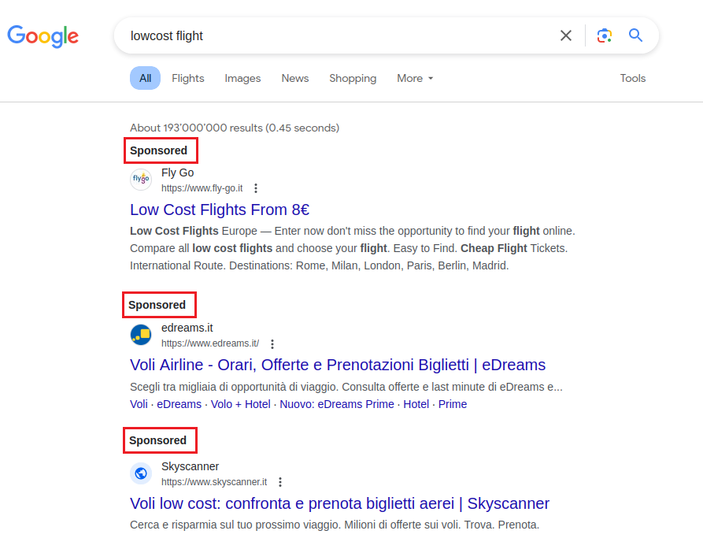

+++
title = 'Annunci dannosi'
date = 2024-04-11T17:04:31+02:00
draft = false
image = '/posts/google-ads/static/cover.png'
+++

# Introduzione

Nel mondo digitale di oggi, è estremamente facile trovare informazioni online. Spesso utilizziamo motori di ricerca come Google, Bing o DuckDuckGo per aiutarci a trovare ciò che stiamo cercando. Che si tratti di visitare un sito web noto o di scoprire qualcosa di nuovo, i motori di ricerca giocano un ruolo fondamentale nel nostro utilizzo di internet.

Ma cosa succede quando ci fidiamo troppo di questi motori di ricerca? Immagina di digitare il nome di una famosa azienda su Google e di cliccare su un link che sembra legittimo, ma che in realtà è una truffa. Questo accade più spesso di quanto si possa pensare nel mondo delle truffe online, dove i truffatori utilizzano annunci sui motori di ricerca per ingannare le persone e farsi consegnare le loro informazioni personali.

In questo post del blog, parleremo di come i truffatori utilizzano Google Ads (precedentemente noto come AdWords) per ingannare le persone e rubare le loro informazioni personali. Spiegheremo come funzionano queste truffe e perché rappresentano un problema. Nonostante gli sforzi per fermare queste truffe da oltre dieci anni, esse continuano a rappresentare un grave pericolo per chi non è cauto online.

Esploreremo anche cosa potrebbe accadere se si cadesse vittima di una di queste truffe. Infine, ti forniremo alcuni consigli su come proteggerti utilizzando la nostra soluzione **BrowserFence**.

## Come funzionano gli annunci di Google

Google Ads è un servizio che permette alle persone di pagare per far apparire il proprio sito web in cima ai risultati di ricerca di Google. Quando cerchi qualcosa su Google, vedrai un elenco di siti web che corrispondono ai tuoi termini di ricerca. Il comportamento normale di un utente è quello di cliccare sul primo link che appare nei risultati di ricerca. Normalmente, il primo link è il più rilevante per la ricerca, il che significa che è il più probabile a contenere le informazioni che stai cercando o la piattaforma a cui vuoi accedere.

La ricerca normale appare così:

 
Now let's see what happens when we search for something that has ads:

Come possiamo vedere dall'immagine sopra, i primi risultati sono annunci. Questo significa che non sono risultati organici, ma piuttosto risultati a pagamento.
Nel riquadro rosso (che abbiamo aggiunto per evidenziare), possiamo vedere la parola "Sponsorizzato", che indica che il risultato è un annuncio,
ma non è sempre facile da individuare, soprattutto se sei di fretta o non presti attenzione.

## Lo scenario di phishing

Ora immagina di cercare il sito di e-banking, digiti il nome della tua banca su Google e clicchi sul primo link che appare. Grazie al fatto che l'etichetta "Sponsorizzato" non è così visibile, non noti che il link è un annuncio. Inserisci il tuo
nome utente, la password, altri codici di sicurezza e clicchi su "Login".

Quello che non sai è che il sito web in cui hai appena inserito le tue informazioni è un sito falso creato dai truffatori per rubare le tue informazioni. Quindi, anche ***senza compromettere la sicurezza della banca***, i truffatori hanno le tue credenziali e ora possono
utilizzare le tue informazioni per rubare i tuoi soldi, la tua identità o persino la tua reputazione.

Uno scenario simile può accadere con qualsiasi sito web, non solo con i login. Ad esempio, potresti cercare un nuovo software e cliccare sul primo link che appare nei risultati di ricerca. Il sito su cui arrivi potrebbe sembrare il sito ufficiale del software, ma in realtà è un sito falso che installerà malware sul tuo computer e, potenzialmente, ***comprometterà tutti i dati della tua azienda***.

## Come i truffatori utilizzano Google Ads

La domanda a questo punto è: come fanno i truffatori a far apparire i loro annunci in cima ai risultati di ricerca di Google? La risposta è semplice: pagano per apparire in cima a specifiche ricerche. Questo significa che possono pagare per far apparire il loro sito falso in cima ai risultati di ricerca quando cerchi qualcosa come "login della mia banca" o "scarica nuovo software".

Quindi Google non ha alcun controllo per verificare la legittimità degli annunci visualizzati? Ovviamente sì, ma i truffatori sono sempre un passo avanti. Utilizzano tecniche specifiche, come il "cloaking", per ingannare i controlli di Google e far passare i loro annunci attraverso il processo di verifica. Soprattutto quando gli annunci mirano a mercati regionali, è difficile per Google verificare la legittimità degli annunci.

## Cosa succede se cadi in una truffa

In questo post del blog non parleremo dei dettagli tecnici dello scenario post-truffa, ma possiamo vedere dal seguente schema cosa succede quando cadi in una truffa:

Questo schema è il risultato di
un'[analisi](https://www.zscaler.com/blogs/security-research/malvertising-campaign-targeting-it-teams-madmxshell) di un caso reale condotta dai ricercatori Roy Tay e Sudeep Singh di Zscaler ThreatLabz.

Anche se non parleremo dei dettagli tecnici, è chiaro che il browser dell'utente diventa la porta d'accesso sfruttata dagli attaccanti tramite gli annunci di Google. Questa manipolazione può servire come il primo passo in una catena di attacchi, compromettendo potenzialmente sia il computer dell'utente che l'infrastruttura aziendale.

## Proteggiti con BrowserFence

Il modo migliore per proteggerti da queste truffe è utilizzare la nostra soluzione **BrowserFence**. La nostra soluzione è in grado di rilevare gli annunci nei risultati di ricerca e evidenziarli con un bordo viola. In questo modo, puoi facilmente individuare gli annunci ed evitare di cliccarci sopra, o almeno essere consapevole che il risultato è un annuncio.

Guarda la seguente animazione per vedere BrowserFence in azione:

    

        

            
            <a href="/posts/google-ads/static/bf.mp4" class="nk-block-video-play video-popup btn-play btn-play-sm btn-play-s2"><em class="btn-play-icon"></em></a>
        

    

 

## Conclusione

In questo post del blog, abbiamo parlato di come i truffatori utilizzano Google Ads per ingannare le persone e farsi consegnare le loro informazioni personali o installare malware sui loro computer. Abbiamo spiegato come funzionano queste truffe e perché rappresentano un problema. Abbiamo anche esaminato cosa potrebbe accadere se si cadesse vittima di una di queste truffe. Infine, ti abbiamo fornito alcuni consigli su come proteggerti utilizzando la nostra soluzione **BrowserFence**.

Speriamo che questo post del blog ti sia stato utile. Se hai domande, non esitare a contattarci. Siamo sempre felici di aiutarti.

<ul class="pt-4 d-flex gaps g-3 justify-content-center  animated" data-animate="fadeInUp" data-delay=".9">
    <li>
        <a href="#" class="btn btn-md btn-grad" data-overlay="bg-theme-grad-alternet"
           style="position: relative; top: 50px;">Installa BrowserFence</a>
    </li>
</ul>
