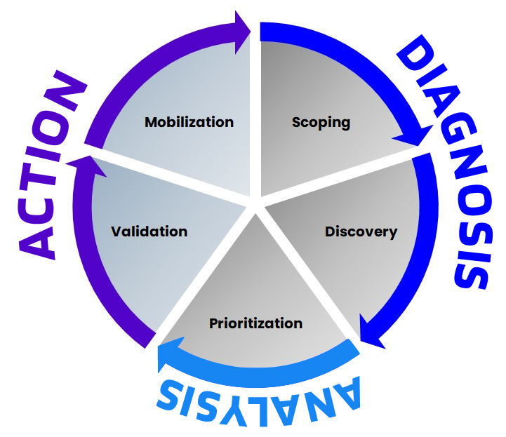

+++
title = 'CTEM sobre Red Teaming'
date = 2024-07-29T17:04:31+02:00
draft = false
image = '/posts/ctem/static/cover.jpg'
+++

## Introducción

En TeamFence, siempre estamos buscando nuevas formas de mejorar la postura de seguridad de nuestros clientes. En esta publicación de blog, discutiremos el marco de Gestión Continua de la Exposición a Amenazas (CTEM) y cómo puede ayudar a las organizaciones a minimizar la exposición a ciberataques. También compararemos el CTEM con el Red Teaming y los ataques simulados para comprender los beneficios de adoptar un enfoque proactivo de la seguridad.

## ¿Qué es CTEM?

La Gestión Continua de la Exposición a Amenazas (CTEM) es un marco dinámico y continuo de cinco etapas diseñado para minimizar la exposición a ciberataques. Este enfoque proactivo ayuda a las organizaciones a identificar vulnerabilidades, mapearlas a posibles rutas de ataque, priorizar según el riesgo para activos críticos y realizar un seguimiento del progreso de los esfuerzos de remediación. Las empresas de todo el mundo están adoptando CTEM para gestionar eficazmente las exposiciones y fortalecer su postura de seguridad.

CTEM implica una evaluación exhaustiva de todo el ecosistema de una organización, incluidos redes, sistemas, activos y más, para detectar exposiciones y debilidades. El objetivo principal es reducir la probabilidad de que los atacantes exploten estas vulnerabilidades. Implementar un programa CTEM asegura una mejora continua de las medidas de seguridad al identificar y abordar áreas potencialmente problemáticas antes de que puedan ser explotadas.

El aspecto "continuo" de CTEM enfatiza la relación iterativa entre el programa CTEM y los esfuerzos de remediación de riesgos. Los datos generados por ambos elementos se informan mutuamente, lo que facilita decisiones cada vez más óptimas sobre la gestión de los riesgos de exposición.

Al aprovechar CTEM, las organizaciones pueden garantizar un marco de seguridad resiliente que se adapta a las amenazas en evolución, protegiendo continuamente sus activos críticos contra ciberataques.

## Los cinco pasos del marco CTEM

#### Etapa 1 – Definición del alcance

La etapa inicial implica comprender sus superficies de ataque y determinar la importancia comercial de cada activo, reconociendo que estos factores evolucionarán con el tiempo. Esto incluye identificar superficies de ataque clave con aportes de varios responsables de toma de decisiones, como líderes de TI, Legal, GRC, Desarrollo, I+D, Producto y Operaciones Comerciales.

#### Etapa 2 – Descubrimiento

Durante la etapa de descubrimiento, se evalúa cada activo para detectar posibles exposiciones y se analizan los riesgos asociados. Esto va más allá de la identificación de vulnerabilidades aisladas para incluir otros tipos de exposiciones, como los riesgos de Active Directory, identidad y configuración, y considera cómo estas exposiciones podrían encadenarse para crear rutas de ataque hacia los activos.

#### Etapa 3 – Priorización

En la etapa de priorización, se analizan las exposiciones para determinar su nivel de amenaza en función de incidentes reales conocidos y la importancia de los activos afectados. Este paso es crucial porque las organizaciones a menudo enfrentan más exposiciones de las que pueden abordar debido al gran volumen y los entornos en constante cambio. CTEM ayuda a priorizar las remediaciones que reducen de manera más efectiva el riesgo para los activos críticos, considerando todos los tipos de exposiciones, incluidas identidades y configuraciones incorrectas.

#### Etapa 4 – Validación

La etapa de validación examina cómo pueden ocurrir los ataques y su probabilidad, utilizando varias herramientas para diferentes propósitos. A veces, la validación ayuda en la priorización como en la Etapa 3, mientras que en otras ocasiones se utiliza para probar continuamente los controles de seguridad o automatizar las pruebas de penetración periódicas.

#### Etapa 5 – Movilización

La etapa de movilización asegura que todos comprendan sus roles y responsabilidades en el contexto del programa. Una movilización efectiva requiere que tanto los equipos de seguridad como los de TI involucrados en los esfuerzos de remediación tengan claridad sobre el valor de reducción de riesgos de sus acciones y puedan informar sobre la tendencia general de las mejoras en la postura de seguridad con el tiempo.

## ¿Es CTEM mejor que Red Teaming?

CTEM y Red Teaming son herramientas valiosas para mejorar la postura de seguridad de una organización, pero cumplen diferentes propósitos. Si nuestro objetivo principal es mejorar la postura de seguridad de una organización, CTEM es el camino a seguir. Veamos por qué:

#### Red Teaming

Una actividad de Red Teaming tiene como objetivo identificar vulnerabilidades en los activos de una empresa simulando un ataque para tomar el control de sistemas críticos. Este proceso involucra a un equipo de hackers éticos que utilizan un enfoque oportunista para encontrar debilidades y explotarlas, centrándose únicamente en lograr su objetivo sin considerar otros problemas o caminos alternativos.

La siguiente imagen podría representar una iteración común de Red Teaming:

 
Si bien el Red Teaming proporciona información valiosa sobre posibles brechas de seguridad, tiene algunas limitaciones notables.

***Primero***, ofrece una instantánea en el tiempo en lugar de una evaluación continua. Las vulnerabilidades identificadas durante un ejercicio de Red Teaming pueden quedar obsoletas rápidamente a medida que surgen nuevas amenazas y evoluciona el entorno de la empresa.

***Segundo***, el Red Teaming no proporciona una visión completa de todas las posibles vulnerabilidades. Se centra en vectores de ataque específicos y rutas, lo que puede dejar sin detectar algunas áreas críticas de exposición. Este enfoque limitado puede resultar en que algunas vulnerabilidades no se detecten, especialmente aquellas que no se alinean con las tácticas específicas utilizadas por el equipo rojo.

***Finalmente***, como podemos ver en la imagen de arriba, el Red Teaming es un proceso que consume mucho tiempo y recursos, lo que puede no ser factible para organizaciones con presupuestos limitados o restricciones operativas. El alto costo y el esfuerzo necesarios para realizar ejercicios de Red Teaming pueden limitar su frecuencia y efectividad en la identificación y resolución de vulnerabilidades. Además, el resultado de un ejercicio de Red Teaming es una lista de vulnerabilidades en lugar de una lista priorizada de exposiciones, lo que a menudo obliga a los clientes a averiguar por sí mismos cómo implementar las medidas necesarias.

### CTEM

Por otro lado, CTEM resuelve muchos de los problemas que una organización podría enfrentar al tratar de mejorar su postura de seguridad:

***Absorción de resultados***: muchas organizaciones luchan para absorber los resultados del Red Teaming u otros ejercicios de simulación de ataques, encontrando los resultados abrumadores y desafiantes de entender y priorizar. CTEM incluye una etapa de movilización que asegura que los equipos internos comprendan completamente los riesgos, lo que les permite priorizar y implementar medidas de remediación de manera efectiva.

***Tiempo y dinero***: debemos tener en cuenta que este tipo de actividades son servicios B2B, y son costosos. CTEM es un enfoque más rentable para la seguridad, ya que la fase de enumeración de los ataques simulados se reemplaza por un esfuerzo colaborativo entre los equipos de seguridad y TI para identificar todos los activos y exposiciones en la organización.

***Cobertura de activos***: CTEM permite una cobertura del 100 % de los activos, ya que la fase de descubrimiento no se limita a los activos que el equipo rojo puede encontrar, sino que es un esfuerzo colaborativo entre los equipos de seguridad y TI. Esto significa que se tienen en cuenta todos los activos y el riesgo se calcula en función de la importancia del activo.

***Continuo***: CTEM es un proceso continuo, lo que significa que la organización siempre está al tanto de los riesgos y puede actuar en consecuencia. El equipo de seguridad puede realizar un seguimiento de los cambios en la infraestructura, seguir las nuevas amenazas y vulnerabilidades emergentes y mantener la postura de seguridad actualizada. Esto elimina gran parte de la responsabilidad de la seguridad del equipo de TI, y el cliente puede centrarse en el negocio.

## Conclusión

En conclusión, si bien el Red Teaming es útil para descubrir ciertas vulnerabilidades y probar la efectividad de las defensas de una empresa contra escenarios de ataque específicos, sus limitaciones destacan la necesidad de evaluaciones de seguridad más continuas, completas y conscientes del contexto.

En TeamFence, creemos que CTEM ofrece un enfoque más efectivo y sostenible para la seguridad al proporcionar la seguridad como un servicio que monitorea y gestiona continuamente la exposición de una organización a las amenazas cibernéticas. Al adoptar CTEM, las empresas pueden identificar y abordar proactivamente las vulnerabilidades, priorizar los esfuerzos de remediación y mantener una postura de seguridad resiliente que se adapte a las amenazas en evolución.

Contáctenos para obtener más información sobre cómo CTEM puede ayudar a su organización a adelantarse a las amenazas cibernéticas y proteger sus activos críticos.
